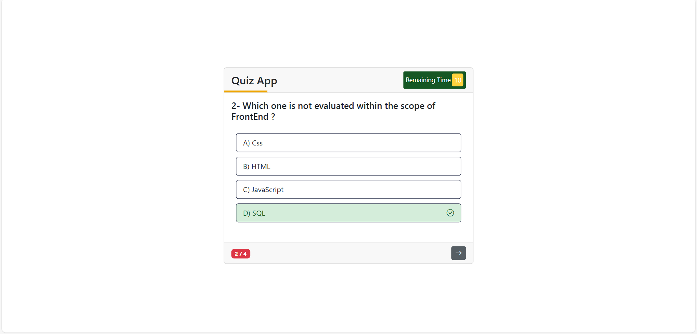
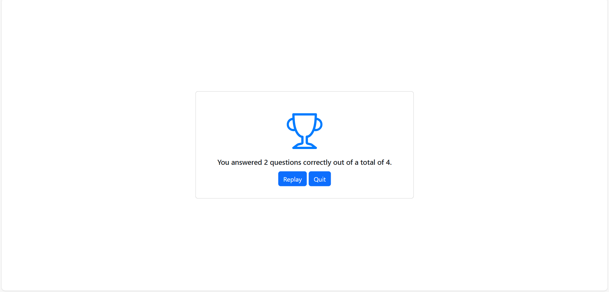

# Quiz App 🎉

This is a beginner-friendly **Quiz Application** developed using **HTML**, **CSS**, **Bootstrap**, and **JavaScript (DOM Manipulation)**. The project focuses on basic DOM operations, timer functionalities, and interactive UI elements.

---

## Features 🚀

✅ **4 Questions Quiz**
✅ **Start Quiz Button** to begin the quiz
✅ **Countdown Timer** that starts from **10 seconds** for each question
✅ **Answer Stops Timer** – when an answer is selected, the timer and its animation pause
✅ **Progress Indicator** showing current question number (e.g., **1/4**)
✅ **Smooth Animations** – button shrink animation when moving to the next question
✅ **Animated Time Line** – a visual line animation that runs for **550ms** and pauses when an answer is chosen
✅ **Responsive Design** with **Bootstrap**

---

## How it works 💡

* Click on **Start Quiz** to begin.
* Each question has a countdown timer.
* When you select an answer, the timer and line animation stop.
* Click **Next Question** to proceed, the timer resets to **10 seconds**.
* After answering all 4 questions, your **final score** will be displayed.

---

## Screenshots 📸

### Start Quiz



### Final Score



---

## Setup Instructions 🚀

1. Clone the repository:
```bash
git clone https://github.com/Selinoztrk/quiz-app.git
```
2. Open the `index.html` file in your browser.

No backend setup required — completely frontend-based!

---

## Technologies Used 🛠️

* `HTML5`
* `CSS3`
* `Bootstrap`
* `JavaScript` (Vanilla DOM Manipulation)

---

## Project Status 📌

✅ Completed – Basic features implemented and working smoothly.
✅ Beginner-friendly – great practice for learning DOM, timers, and simple animations.

---